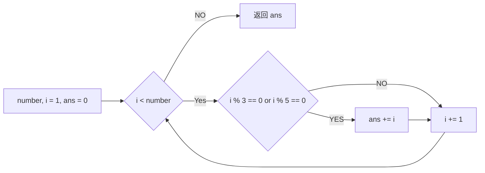

# 实验三 Python列表
班级： 21计科04

学号： B20210302406

姓名： 陈健

Github地址：https://github.com/ruoyu88/python_task

CodeWars地址：https://www.codewars.com/users/%E5%BD%92%E7%A6%BB%E5%8E%9F

## 实验目的
学习Python的简单使用和列表操作
学习Python中的if语句
## 实验环境
Git
Python 3.10
VSCode
VSCode插件
## 实验内容和步骤
### 第一部分
Python列表操作

完成教材《Python编程从入门到实践》下列章节的练习：

第3章 列表简介
第4章 操作列表
第5章 if语句
### 第二部分
在Codewars网站注册账号，完成下列Kata挑战：

第一题：3和5的倍数（Multiples of 3 or 5）
难度： 6kyu

如果我们列出所有低于 10 的 3 或 5 倍数的自然数，我们得到 3、5、6 和 9。这些数的总和为 23. 完成一个函数，使其返回小于某个整数的所有是3 或 5 的倍数的数的总和。此外，如果数字为负数，则返回 0。

注意：如果一个数同时是3和5的倍数，应该只被算一次。

提示：首先使用列表解析得到一个列表，元素全部是3或者5的倍数。 使用sum函数可以获取这个列表所有元素的和.

代码提交地址： https://www.codewars.com/kata/514b92a657cdc65150000006

第二题： 重复字符的编码器（Duplicate Encoder）
难度： 6kyu

本练习的目的是将一个字符串转换为一个新的字符串，如果新字符串中的每个字符在原字符串中只出现一次，则为"("，如果该字符在原字符串中出现多次，则为")"。在判断一个字符是否是重复的时候，请忽略大写字母。

例如:

"din"      =>  "((("
"recede"   =>  "()()()"
"Success"  =>  ")())())"
"(( @"     =>  "))(("
代码提交地址: https://www.codewars.com/kata/54b42f9314d9229fd6000d9c

第三题：括号匹配（Valid Braces）
难度：6kyu

写一个函数，接收一串括号，并确定括号的顺序是否有效。如果字符串是有效的，它应该返回True，如果是无效的，它应该返回False。 例如：

"(){}[]" => True 
"([{}])" => True
 "(}" => False
 "[(])" => False 
"[({})](]" => False
提示： python中没有内置堆栈数据结构，可以直接使用list来作为堆栈，其中append方法用于入栈，pop方法可以出栈。

代码提交地址 https://www.codewars.com/kata/5277c8a221e209d3f6000b56

第四题： 从随机三元组中恢复秘密字符串(Recover a secret string from random triplets)
难度： 4kyu

有一个不为你所知的秘密字符串。给出一个随机三个字母的组合的集合，恢复原来的字符串。

这里的三个字母的组合被定义为三个字母的序列，每个字母在给定的字符串中出现在下一个字母之前。"whi "是字符串 "whatisup "的一个三个字母的组合。

作为一种简化，你可以假设没有一个字母在秘密字符串中出现超过一次。

对于给你的三个字母的组合，除了它们是有效的三个字母的组合以及它们包含足够的信息来推导出原始字符串之外，你可以不做任何假设。特别是，这意味着秘密字符串永远不会包含不出现在给你的三个字母的组合中的字母。

测试用例：

secret = "whatisup"
triplets = [
  ['t','u','p'],
  ['w','h','i'],
  ['t','s','u'],
  ['a','t','s'],
  ['h','a','p'],
  ['t','i','s'],
  ['w','h','s']
]
test.assert_equals(recoverSecret(triplets), secret)
代码提交地址： https://www.codewars.com/kata/53f40dff5f9d31b813000774/train/python

提示：

利用集合去掉triplets中的重复字母，得到字母集合letters，最后的secret应该由集合中的字母组成，secret长度也等于该集合。
letters = {letter for triplet in triplets for letter in triplet }
length = len(letters)
创建函数check_first_letter(triplets, first_letter)，检测一个字母是不是secret的首字母，返回True或者False。
创建函数remove_first_letter(triplets, first_letter), 从三元组中去掉首字母，返回新的三元组。
遍历字母集合letters，利用上面2个函数得到最后的结果secret。
第五题： 去掉喷子的元音（Disemvowel Trolls）
难度： 7kyu

喷子正在攻击你的评论区! 处理这种情况的一个常见方法是删除喷子评论中的所有元音(字母：a,e,i,o,u)，以消除威胁。 你的任务是写一个函数，接收一个字符串并返回一个去除所有元音的新字符串。 例如，字符串 "This website is for losers LOL!" 将变成 "Ths wbst s fr lsrs LL!".

注意：对于这个Kata来说，y不被认为是元音。 代码提交地址： https://www.codewars.com/kata/52fba66badcd10859f00097e

提示：

首先使用列表解析得到一个列表，列表中所有不是元音的字母。
使用字符串的join方法连结列表中所有的字母，例如：
last_name = "lovelace"
letters = [letter for letter in last_name ]
print(letters) # ['l', 'o', 'v', 'e', 'l', 'a', 'c', 'e']
name = ''.join(letters) # name = "lovelace"
### 第三部分
使用Mermaid绘制程序流程图

安装VSCode插件：

Markdown Preview Mermaid Support
Mermaid Markdown Syntax Highlighting
使用Markdown语法绘制你的程序绘制程序流程图（至少一个），Markdown代码如下：

程序流程图

显示效果如下：


查看Mermaid流程图语法-->点击这里

使用Markdown编辑器（例如VScode）编写本次实验的实验报告，包括实验过程与结果、实验考查和实验总结，并将其导出为 PDF格式 来提交。

## 实验过程与结果
请将实验过程与结果放在这里，包括：

### 第一部分 Python列表操作和if语句
### 第二部分 Codewars Kata挑战
1.
``````
def solution(number):
    pass
    if number <= 0:
        return 0
    sum = 0
    for i in range(1,number):
        if i%3 == 0 or i%5 == 0:
            sum += i
    return sum
``````
2.
``````
def duplicate_encode(word):
    #your code here
    word = word.lower()
    ch=''
    for key in range(len(word)):
        if word.count(word[key]) > 1:
            ch+=')'
        else:
            ch+='('
    return ch
``````
3.
``````
def valid_braces(string):
    pass
    ans = [] 
    #创建一个空栈，用于字符串中符号的出入栈
    dict = {')':'(',']':'[','}':'{'}
    #创建一个括号字典，用于匹配括号对
    if len(string) % 2 != 0:
        return False
    for ch in string:
        if ch in dict:
            if len(ans) > 0 and dict[ch] == ans[-1]:
                ans.pop()
            else:
                return False
        else:
            ans.append(ch)
    return not ans
``````
4.
``````
def recoverSecret(triplets):
    'triplets is a list of triplets from the secrent string. Return the string.'
    letters = list(set([l for t in triplets for l in t]))        
            
    for t in triplets * len(letters):
        for i in range(len(t)-1):
            a, b = letters.index(t[i]), letters.index(t[i+1])
            if( a > b ): letters[b], letters[a] = letters[a], letters[b]
            
    return ''.join(letters)
``````
5.
``````
def disemvowel(string_):
    string_ = string_.replace('a','').replace('e','').replace('i','').replace('o','').replace('u','')
    string_ = string_.replace('A','').replace('E','').replace('I','').replace('O','').replace('U','')
    return string_
``````
### 第三部分 使用Mermaid绘制程序流程图


注意代码需要使用markdown的代码块格式化，例如Git命令行语句应该使用下面的格式：

Git命令

显示效果如下：
```bash
git init
git add .
git status
git commit -m "first commit"
```
如果是Python代码，应该使用下面代码块格式，例如：

Python代码

显示效果如下：

```python
def add_binary(a,b):
    return bin(a+b)[2:]
```
代码运行结果的文本可以直接粘贴在这里。

注意：不要使用截图，Markdown文档转换为Pdf格式后，截图可能会无法显示。

## 实验考查
请使用自己的语言并使用尽量简短代码示例回答下面的问题，这些问题将在实验检查时用于提问和答辩以及实际的操作。


#### 1. Python中的列表可以进行哪些操作？
   增删改查
#### 2. 哪两种方法可以用来对Python的列表排序？这两种方法有和区别？
   对List进行排序，Python提供了两个方法 方法1.用List的内建函数list.sort进行排序 list.sort (func=None, key=None, reverse=False) Python实例： 方法2.用序列类型函数sorted (list)进行排序 Python实例： 两种方法的区别： sorted (list)返回一个对象，可以用作表达式。
#### 3. 如何将Python列表逆序打印？
使用reversed函数或切片操作
#### 4. Python中的列表执行哪些操作时效率比较高？哪些操作效率比较差？是否有类似的数据结构可以用来替代列表？
效率高：查找，增加、删除元素，
效率低：将多维列表合成一维，

#### 5. 阅读《Fluent Python》Chapter 2. An Array of Sequence - Tuples Are Not Just Immutable Lists小节（p30-p35）。总结该小节的主要内容。

## 实验总结
本次实验我初步学会了如何处理列表中的多个元素以及对列表本身的运用有了一定了解。
在此次实验中的第三四题中，我对python中的栈以及部分函数的有了一定了解并能够初步运用。
总结一下这次实验你学习和使用到的知识，例如：编程工具的使用、数据结构、程序语言的语法、算法、编程技巧、编程思想。
    