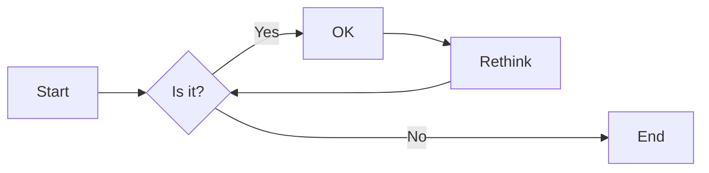

实验二 Python变量、简单数据类型
班级： 21计科4班

学号： B20210302406

姓名： 陈健

Github地址：https://github.com/ruoyu88/python_course

CodeWars地址：https://www.codewars.com/users/%E5%BD%92%E7%A6%BB%E5%8E%9F

实验目的
使用VSCode编写和运行Python程序
学习Python变量和简单数据类型
实验环境
Git
Python 3.10
VSCode
VSCode插件
实验内容和步骤
第一部分
实验环境的安装

安装Python，从Python官网下载Python 3.10安装包，下载后直接点击可以安装：Python官网地址
为了在VSCode集成环境下编写和运行Python程序，安装下列VScode插件
Python
Python Environment Manager
Python Indent
Python Extended
Python Docstring Generator
Jupyter
indent-rainbow
Jinja
第二部分
Python变量、简单数据类型和列表简介

完成教材《Python编程从入门到实践》下列章节的练习：

第2章 变量和简单数据类型
第三部分
在Codewars网站注册账号，完成下列Kata挑战：

第1题：求离整数n最近的平方数（Find Nearest square number）
难度：8kyu

你的任务是找到一个正整数n的最近的平方数 例如，如果n=111，那么nearest_sq(n)（nearestSq(n)）等于121，因为111比100（10的平方）更接近121（11的平方）。 如果n已经是完全平方（例如n=144，n=81，等等），你需要直接返回n。 代码提交地址 https://www.codewars.com/kata/5a805d8cafa10f8b930005ba

第2题：弹跳的球（Bouncing Balls）
难度：6kyu

一个孩子在一栋高楼的第N层玩球。这层楼离地面的高度h是已知的。他把球从窗口扔出去。球弹了起来, 例如:弹到其高度的三分之二（弹力为0.66）。他的母亲从离地面w米的窗户向外看,母亲会看到球在她的窗前经过多少次（包括球下落和反弹的时候）？

一个有效的实验必须满足三个条件：

参数 "h"（米）必须大于0
参数 "bounce "必须大于0且小于1
参数 “window "必须小于h。
如果以上三个条件都满足，返回一个正整数，否则返回-1。 注意:只有当反弹球的高度严格大于窗口参数时，才能看到球。 代码提交地址 https://www.codewars.com/kata/5544c7a5cb454edb3c000047/train/python

第3题： 元音统计(Vowel Count)
难度： 7kyu

返回给定字符串中元音的数量（计数）。对于这个Kata，我们将考虑a、e、i、o、u作为元音（但不包括y）。输入的字符串将只由小写字母和/或空格组成。

代码提交地址： https://www.codewars.com/kata/54ff3102c1bad923760001f3

第4题：偶数或者奇数（Even or Odd）
难度：8kyu

创建一个函数接收一个整数作为参数，当整数为偶数时返回”Even”当整数位奇数时返回”Odd”。 代码提交地址： https://www.codewars.com/kata/53da3dbb4a5168369a0000fe

第四部分
使用Mermaid绘制程序流程图

安装Mermaid的VSCode插件：

Markdown Preview Mermaid Support
Mermaid Markdown Syntax Highlighting
使用Markdown语法绘制你的程序绘制程序流程图（至少一个），Markdown代码如下：

程序流程图

显示效果如下：


查看Mermaid流程图语法-->点击这里(https://mermaid.js.org/syntax/flowchart.html)

使用Markdown编辑器（例如VScode）编写本次实验的实验报告，包括实验过程与结果、实验考查和实验总结，并将其导出为 PDF格式 来提交。

实验过程与结果
请将实验过程与结果放在这里，包括：

第二部分 Python变量、简单数据类型和列表简介
第三部分 Codewars Kata挑战
1.
``````
def nearest_sq(n):
    # pass
    m = n ** 0.5
    x = int(m) ** 2
    y = int(m+1) ** 2
    if x ** 0.5 == m:
        return n
    if y - n > n - x:
        return x
    else :
        return y
``````

2.
``````
def bouncing_ball(h, bounce, window):
    # your code
    if h <= 0 or h <= window or bounce <= 0 or bounce >= 1:
        return -1
    count = 1
    while h * bounce > window:
        h = h * bounce
        count+=2
    return count
``````

3.
``````
def get_count(sentence):
    pass
    count = 0
    for x in sentence:
        if x == 'a' or x == 'e' or x == 'i' or x == 'o' or x == 'u':
            count += 1
    return count
``````

4.
``````
def even_or_odd(number):
    if number % 2 == 0:
        return 'Even'
    return 'Odd'
 ``````

第四部分 使用Mermaid绘制程序流程图
第四题流程图:

``````mermaid
flowchart LR
    A[Start] --> B[number为偶数]
    B -- Yes --> C[输出'Even']
    B -- No ----> D[输出'Odd']
    C --> E[End]
    D --> E[End]
```````

效果截图

注意代码需要使用markdown的代码块格式化，例如Git命令行语句应该使用下面的格式：

Git命令
显示效果如下：

```bash
git init
git add .
git status
git commit -m "first commit"
```

如果是Python代码，应该使用下面代码块格式，例如：

Python代码

显示效果如下：

```python
def add_binary(a,b):
    return bin(a+b)[2:]
```

代码运行结果的文本可以直接粘贴在这里。

注意：不要使用截图，Markdown文档转换为Pdf格式后，截图可能会无法显示。

实验考查
请使用自己的语言并使用尽量简短代码示例回答下面的问题，这些问题将在实验检查时用于提问和答辩以及实际的操作。

Python中的简单数据类型有那些？我们可以对这些数据类型做哪些操作？
int 整数型，字符串，bool 布尔类型，float 浮点型,list 列表,元组,字典,集合。
可以进行加减乘除，比较大小等操作;还可以进行复制，修改，删除，索引等操作。
为什么说Python中的变量都是标签？
因为python变量不占用空间，占用的是数据本身。重新给变量复制就相当于撕下这个标签，重新贴到另一个数据上。
有哪些方法可以提高Python代码的可读性？
1.写注释
2.添加类型提示
3.合理使用变量
4.合理命名
实验总结
总结一下这次实验你学习和使用到的知识，例如：编程工具的使用、数据结构、程序语言的语法、算法、编程技巧、编程思想。
在本次实验中，刚开始我对python代码的编写有点无从下手，经过多次尝试和利用教学资料及网络资料后，我学会了python语言的基本编写格式，然后对for循坏，if语句等函数有了一定的了解与应用。此外，对列表的性质和操作也有了一定了解。最后我还基本学会了使用markdown绘制程序流程图。